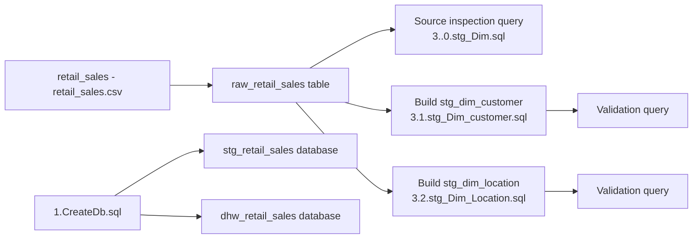
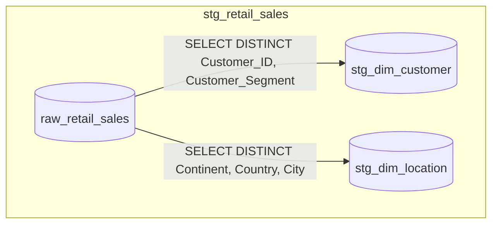
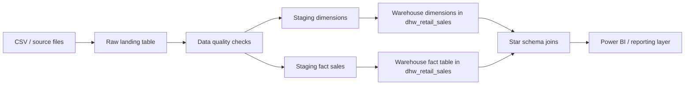

# Retail Sales SQL Pipeline

## Overview
This folder contains SQL scripts for a simple staging pipeline.
The pipeline reads raw retail sales data and builds staging dimension tables.

Current focus:
- Set up databases
- Inspect source columns
- Build customer dimension staging table
- Build location dimension staging table

## Files In This Folder
- 1.CreateDb.sql
- 3..0.stg_Dim.sql
- 3.1.stg_Dim_customer.sql
- 3.2.stg_Dim_Location.sql
- retail_sales - retail_sales.csv

## What Happens To The Data
1. Databases are created if they do not already exist.
2. Raw source table is inspected: stg_retail_sales.dbo.raw_retail_sales.
3. Distinct customer values are loaded into stg_retail_sales.dbo.stg_dim_customer.
4. Distinct location values are loaded into stg_retail_sales.dbo.stg_dim_location.
5. Validation SELECT queries are used to review staged results.

## Current Data Flow Diagram

## Script Execution Order
Run scripts in this order:
1. 1.CreateDb.sql
2. Load data into stg_retail_sales.dbo.raw_retail_sales (if not loaded yet)
3. 3..0.stg_Dim.sql
4. 3.1.stg_Dim_customer.sql
5. 3.2.stg_Dim_Location.sql

## Current Model Snapshot

## Future Flow (Recommended)
This is a suggested next phase for scaling your project.

## Future Improvements
- Add a fact staging script for sales transactions.
- Add primary keys and surrogate keys for dimension tables.
- Add null handling and data type standardization.
- Add deduplication rules beyond DISTINCT (business keys + latest record logic).
- Add indexes for faster joins and reporting.
- Add audit columns such as load_date and source_file.
- Add stored procedures for scheduled ETL execution.
- Add row count checks and data quality validation steps.

## Quick Validation Queries
Use these checks after each load:
- Count customer rows in stg_dim_customer.
- Count location rows in stg_dim_location.
- Check for null key attributes in dimensions.
- Compare distinct counts between source and staged tables.
